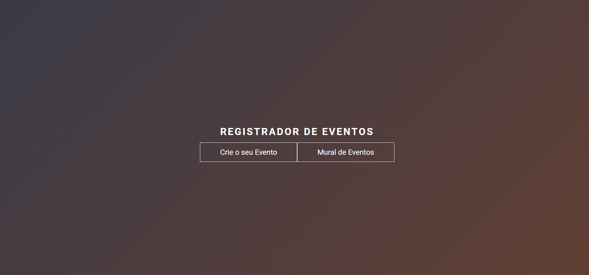

# Aplicação Eventos



<a href="#💻tecnologias">Tecnologias</a> | <a href="#projeto"> Projeto</a> |<a href= "#projeto"> Instruções de Uso </a>|

## Projeto

Essa é uma aplicação em que o cliente preenche um formulario para a criação de um evento e essas informações serão salvas
no banco de dados . Que alimentará a tabela de eventos.

## 💻Tecnologias

Durante o desenvolvimento do projeto foram utilizadas as seguintes tecnologias:

- HTML5
- CSS3
- JavaScript
- Node.js
- Prisma "ORM"
- Git e GitHub

## Instruções de Uso

### Cliente (client.js)

1. Entre no index.html e escolha o botão "Crie Seu Evento" ou "Mural de eventos"

2. Se o "Crie Seu Evento" for escolhido ,abre a página para preencher o formulário e se o botão "Mural de eventos" for escolhido abre a página da tabela com os eventos já criados.

3. Na página do formulário após ser preenchido , pressione Enviar e aparecerá um Toast de confirmação.

4. O cliente enviará o formulário para o banco de dados e exibirá esses dados na página tabela.

### Servidor (server.js)

1. Abra um novo terminal na pasta do projeto.

2. Execute o seguinte comando para iniciar o

```bash
cd backend
```

3. Instale as dependências e inicie o servidor

```bash
npm i
npm run server
```

4. O servidor estará ouvindo na porta 8000. Certifique-se de que nenhum outro programa esteja usando essa porta.

#### Colaboradores

- Eduardo Silva Santa Rosa
- Iris Fernanda Celestino
- Lucas Campos
- Maison Luck
